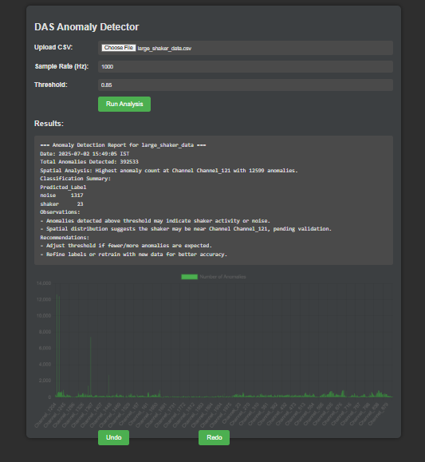

# 📱 FiberSenseAI - DAS Time-Series Analysis Flask App

A web-based anomaly detection system built with Flask that analyzes Distributed Acoustic Sensing (DAS) time-series data.
It identifies "shaker" vs "noise" events using a trained KNN classifier and visualizes the anomalies with charts and downloadable reports.

---

## 🚀 Features

* 📁 Upload DAS `.csv` files
* ⚙️ Configure Sample Rate and Threshold
* 📊 Real-time waveform anomaly analysis
* 🧟‍♂️ KNN-based classification (`shaker` vs `noise`)
* 📈 Dynamic chart with most affected channels
* 📄 Downloadable reports (`.csv` & `.txt`)
* ⚖️ Class imbalance handled using Random Oversampling
* 🌐 Flask-based modern web interface

---

## 🖼️ Output UI

> Sample dashboard output after uploading a DAS CSV file:



---

## 🧠 Tech Stack

* Python 3.10+
* Flask
* Scikit-learn
* imbalanced-learn
* Pandas, NumPy, Matplotlib
* HTML5 (Jinja2) + Bootstrap

---

## 📁 Folder Structure

```
das_flask_app/
├── app.py                      # Main Flask backend logic
├── templates/
│   └── index.html              # HTML frontend
├── static/
│   └── output.png              # Output screenshot
├── uploads/                    # Stores uploaded files
├── das_labeled_anomalies.csv  # Training labels
└── README.md                   # This file
```

---

## ⚙️ Setup Instructions

### 1. Clone this Repository

```bash
git clone https://github.com/vishnudev-p/FiberSenseAI-DAS.git
cd FiberSenseAI-DAS
```

### 2. Create a Virtual Environment & Activate

```bash
python -m venv venv
venv\Scripts\activate         # For Windows
# source venv/bin/activate   # For macOS/Linux
```

### 3. Install Required Packages

```bash
pip install -r requirements.txt
```

If `requirements.txt` isn't available, install manually:

```bash
pip install flask pandas numpy matplotlib scikit-learn imbalanced-learn
```

---

## ▶️ Run the App

```bash
python app.py
```

Visit in browser:
📍 [http://127.0.0.1:5000/](http://127.0.0.1:5000/)

---

## 📊 How It Works

1. Upload a `.csv` file with DAS time-series data.
2. System preprocesses time and channel info.
3. Anomalies above threshold are extracted.
4. A trained KNN model classifies anomalies.
5. A summary report and chart are generated.
6. You can download:

   * Anomalies CSV
   * Text report
   * View real-time chart on dashboard

---

## ✅ Example CSV Format

The input `.csv` should look like:

```
Time,Channel_1,Channel_2,...,Channel_N
2023-01-01 00:00:00.000,0.12,0.15,...,0.10
...
```

---

## 📄 Sample Report Output

```
=== Anomaly Detection Report ===
Date: 2025-07-02 14:05:00 IST
Total Anomalies Detected: 52
Highest anomaly count: Channel_12
Classification Summary:
shaker    31
noise     21

Observations:
- Anomalies detected above threshold may indicate shaker activity or noise.
- Spatial distribution suggests the shaker may be near Channel_12.

Recommendations:
- Adjust threshold if fewer/more anomalies are expected.
- Retrain with better labeled data for improved accuracy.
```

---

## 🧠 Model Details

* **Algorithm**: K-Nearest Neighbors (KNN)
* **Features Used**:

  * `Time_seconds`
  * `Channel_number`
* **Handling Imbalance**: RandomOverSampler (`imblearn`)
* **Scalers**: StandardScaler

---

## 📜 License

This project is licensed under the MIT License.

---

## 🙌 Credits

Built by **[Vishnu Dev P](https://github.com/vishnudev-p)**
For real-time anomaly detection using fiber optic DAS signals.
